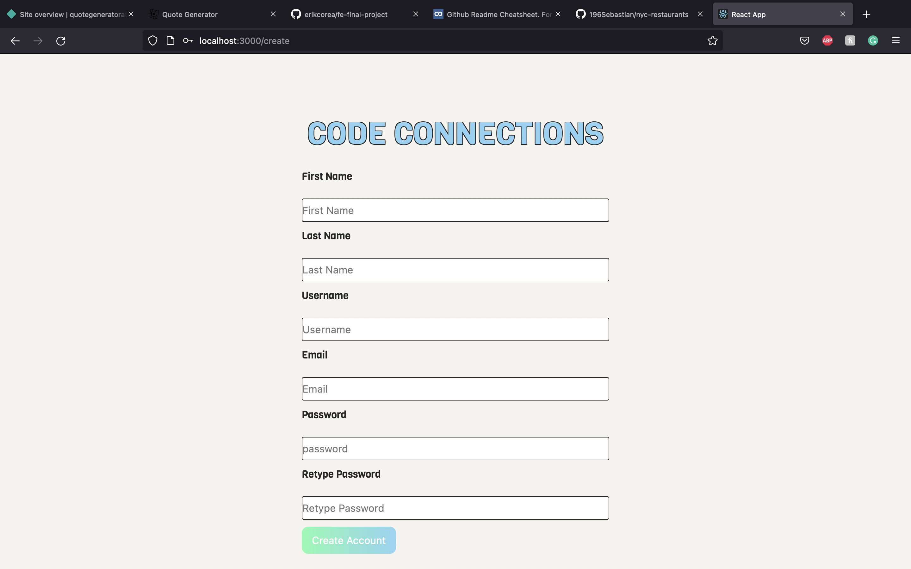

# Code Connections

## Project Description
- An application that allows users to find other people via a post, with the skills listed, to collaberate and create a project.
- Users can add a description of the project along with the skills need for the project they are working on, UI/UX,Python,SQL,AWS, etc.
- Clicking on join button will allow creator of post to see your email so they can contact you for further info.
- Creators of posts have full CRUD to remove skills as they find and delete post when they have everything they need.

### APP STILL WORK IN PROGRESS